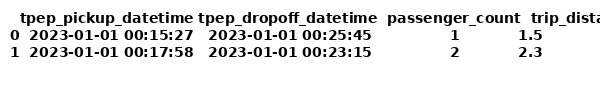

# NYC Taxi Data ETL Pipeline (ZIP → CSV → SQLite)

## 🚕 Overview
This beginner-friendly project demonstrates a complete local ETL (Extract-Transform-Load) pipeline using **real NYC Yellow Taxi Trip data**. The pipeline starts from a **zipped dataset**, extracts and cleans the data using Python, and loads it into a local **SQLite database** for analysis.

You don’t need cloud services or complex tools to get started — this project runs locally and teaches core Data Engineering concepts with a real-world dataset.

---

## 🧰 Tech Stack

- Python 3.10  
- pandas  
- SQLite3  
- Zipfile module (standard Python)  
- cron or bash (optional for automation)

---

## 🧱 Architecture Diagram

```
[yellow_tripdata_filtered.zip]
         ↓
[extract.py] → Unzip + read CSV
         ↓
[transform.py] → Clean & convert types
         ↓
[load.py] → Store data into SQLite DB
```

---

## 🧪 How to Run This Project

### 1. Clone the Repository

```bash
git clone https://github.com/AvantikkaPenumarty/nyc_taxi_pipeline.git
cd nyc_taxi_pipeline
```
---

### ✅ Where Does the Cloned Folder Exist?

When you run:

```bash
git clone https://github.com/AvantikkaPenumarty/nyc_taxi_pipeline.git
```

You are downloading a **copy of MY GitHub repository to your local machine**.

- The folder now exists **locally** (on your computer).
- Any changes you make in this folder **won’t reflect on GitHub** until you commit and push them back.

---

### 📁 How to Check Where It Got Cloned

Immediately after cloning, run:

```bash
pwd
```

This will print the full local path of your cloned repo.  
Example output:

```
/Users/yourname/Documents/nyc_taxi_pipeline
```

---

💡 Tip: You can navigate into the folder using:

```bash
cd nyc_taxi_pipeline
```


### 2. Install Dependencies

```bash
pip install pandas
```

> ⚠️ **macOS/Homebrew Users – If You See an Error Like This**:

```
error: externally-managed-environment
```

This means you're trying to install Python packages globally in a restricted system environment.

✅ **Recommended Fix (use a virtual environment)**:

```bash
python3 -m venv venv
source venv/bin/activate
python3 -m pip install pandas
```

This creates an isolated Python environment and avoids breaking system packages.


### 3. Dataset

📦 **Download the dataset**  
You can download the filtered dataset ZIP from this [Google Drive link](https://drive.google.com/file/d/1XC6DLyJm66p3r4PAk8dzN3GiPnLl2WIa/view?usp=sharing).

📁 **Setup instructions:**

After downloading:

1. Create a folder named `data` in your project root (if not already present).  
2. Move the downloaded `.zip` file into that folder.

Your directory should look like this:

```
nyc_taxi_pipeline/
├── data/
│   └── yellow_tripdata_filtered.zip
└── README.md
```

This file contains a filtered sample of NYC Yellow Taxi trip data originally sourced from [NYC Open Data](https://www.nyc.gov/site/tlc/about/tlc-trip-record-data.page).

### 4. Run the ETL Pipeline

```bash
python scripts/run_pipeline.py
```

This will:
- Unzip the file
- Read the CSV into pandas
- Clean and transform the data
- Load the final table into `/output/nyc_taxi.db`

---

## 📸 Screenshot



---

## ✅ Key Concepts You’ll Learn

- Extracting data from compressed formats  
- Data cleaning and type optimization with pandas  
- Writing to a relational SQLite database  
- Structuring a modular ETL pipeline  
- Reproducible local development workflow

---

## 🔎 Bonus Tip

This project mirrors the **foundational structure used in real production pipelines**, minus the cloud complexity. It’s the perfect starting point to showcase on your GitHub portfolio if you're breaking into Data Engineering.
> 💡 Want to make your own version of this project?
> Fork the repo, make changes locally, then push to your GitHub!
---

## 📬 Questions?

DM [Avantikka Penumarty](https://linkedin.com/in/avantikap) on LinkedIn or check out the [Zero2DataEngineer Newsletter](https://zero2dataengineer.substack.com) for more hands-on guides.
